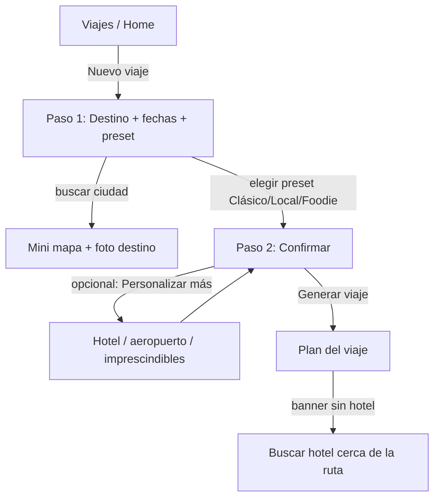
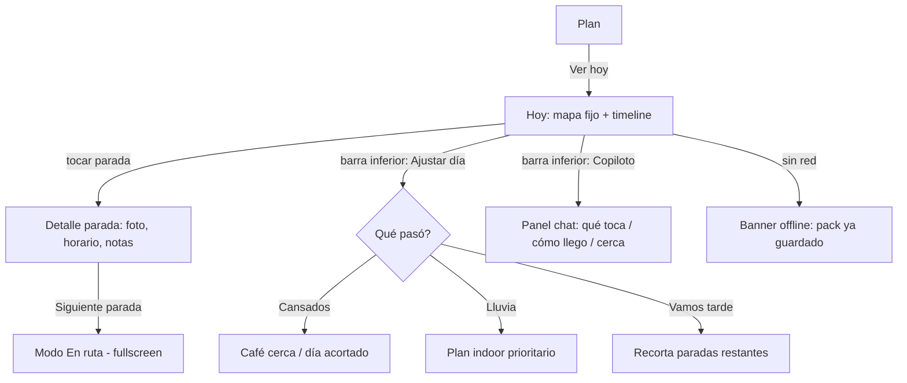
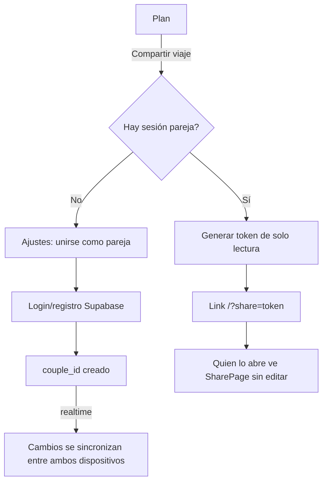

# RutaDos v2 — Visión de producto y auditoría (Fase 0)

**Fecha:** 23 jul 2026
**Alcance:** solo visión + decisiones. Sin código de UI, sin CSS, sin cambios de store.
**Relacionado:** `docs/DIFERENCIAL.md` (posicionamiento), `docs/REFERENCIAS_IDEAS.md` (inventario visual previo), `docs/PUNTO_SITUACION.md` (estado técnico), `docs/preview-light-ui.html` (spec estático de tokens).

---

## 1. Resumen ejecutivo

RutaDos es un planificador de viajes gratuito que genera un itinerario día a día con datos abiertos reales (mapa, POIs, transporte, clima) y que **sigue siendo útil una vez en destino**, ajustando el plan cuando el día cambia (cansancio, lluvia, se hace tarde). No es un generador de "plan bonito y listo" que se abandona al llegar al aeropuerto: es un compañero de bolsillo para antes y, sobre todo, durante el viaje.

**Para quién:** viajeros independientes (solos, en pareja o con amigos) que quieren decidir ellos mismos qué ver y comer, con ayuda de datos reales, sin pagar suscripción ni depender de un chat de IA genérico que decide por ellos.

**Lo que NO es v2:** un catálogo de reservas (Booking/GetYourGuide con API propia), un diario de viaje tipo Polarsteps, ni un chatbot como pantalla principal. El copiloto (reglas + Telegram) es una utilidad de apoyo, no el producto.

La versión actual ya tiene un motor de planificación sólido (OSM/OTM/Open-Meteo/OSRM, todo gratis) y features diferenciales reales (replan in situ, offline del día, export a Google Maps) — pero la **navegación** no refleja bien esos jobs, y hay pantallas enteras construidas que nadie puede abrir. v2 es principalmente un rediseño de arquitectura de información y consolidación, no una reescritura del motor.

---

## 2. Auditoría del producto actual

### 2.1 Mapa funcional real (módulos → qué hacen)

| Módulo | Qué hace | Archivos clave |
|---|---|---|
| **Motor de descubrimiento** | Consulta Overpass (OSM) + opcionalmente OpenTripMap, clasifica POIs por categoría, les da un score según gustos/exploración | `src/lib/discover.ts`, `src/lib/opentripmap.ts` |
| **Motor de planificación** | Reparte POIs en días según ritmo/movilidad/logística, optimiza orden, recalcula transporte entre paradas, gestiona "caos" (cansados/lluvia/tarde) y "enfoque del día" (central/mixto/afueras) | `src/lib/plan.ts`, `src/lib/tripScale.ts` |
| **Store / estado** | Zustand + persist a `localStorage` (`rutados-storage`). Máquina de estados de navegación plana (`view.name`), draft del wizard, CRUD de viajes y paradas, hooks de sync | `src/store.ts` |
| **Geocoding** | Ciudad, hotel, aeropuertos vía Nominatim | `src/lib/geocode.ts`, `src/lib/airports.ts` |
| **Mapa** | Leaflet + tiles OSM, pines por categoría/color, popups con fotos, rutas por tramo | `src/components/TripMap.tsx`, `src/lib/categoryColors.ts` |
| **Clima** | Open-Meteo por día, sin key | `src/lib/weather.ts` |
| **Fotos** | Wikipedia/Wikimedia para paradas, Unsplash (URLs fijas) para hero/destinos, OpenTripMap para venues | `src/lib/placePhotos.ts`, `src/lib/placeWiki.ts`, `src/lib/quickDestinations.ts` |
| **Venues cercanos** | Hoteles/restaurantes/cafés vía OSM (+ OTM opcional), priorizando los que tienen web/teléfono | `src/lib/nearbyVenues.ts`, `src/components/VenueFinder.tsx` |
| **Deep links de reserva** | Booking (con `aid` opcional), TheFork/OpenTable si OSM trae web, Google Maps | `src/lib/bookingLinks.ts`, `src/lib/mapsUrl.ts` |
| **Offline del día** | Snapshot en `localStorage` del día activo (paradas, horarios, links Maps precalculados) para usar sin red | `src/lib/offlineDay.ts`, `src/components/OfflineBanner.tsx` |
| **Copiloto (motor)** | Reglas (sin LLM) que responden "qué toca ahora", "ruta de hoy", "cómo llego", "qué hay cerca", "está cerrado", "vamos tarde" usando el trip real + ubicación | `src/lib/copilot.ts` |
| **Copiloto (Telegram)** | Bot público, mismo tipo de lógica, deep link `/start TOKEN` para enlazar el viaje | `supabase/functions/telegram-bot/index.ts`, `docs/COPILOTO_TELEGRAM.md` |
| **Copiloto (in-app)** | Chat dentro de la app con geolocalización y parsing de links de Maps | `src/pages/CopilotPage.tsx` |
| **Sync pareja** | Supabase realtime, `couple_id`, merge de trips | `src/lib/sync.ts`, `src/authStore.ts` |
| **Share** | Token de solo lectura vía RPC de Supabase | `src/lib/share.ts`, `src/pages/SharePage.tsx` |
| **Presupuesto** | Estimación orientativa por ciudad/días, sin API de pago | `src/lib/budget.ts` |
| **Import/export** | KML, Google My Maps, pegar links de Maps, JSON | `src/lib/exportGmaps.ts`, `src/lib/importGmaps.ts` |
| **Guías de ciudad** | Enlaces oficiales de transporte/museos curados a mano | `src/lib/cityGuides.ts`, `src/pages/GuidesPage.tsx` |
| **Constructor manual** | Armar un día a mano eligiendo pines en el mapa | `src/pages/BuildPage.tsx` |
| **Marketplace (preparado, inerte)** | Hook para boost de listings patrocinados, sin datos reales aún | `src/lib/partners.ts` |
| **Licencias/atribución** | Sección Ajustes + doc, cumplimiento ODbL/OTM ya resuelto | `src/components/DataLicensesSection.tsx`, `docs/DATOS_LICENCIAS.md` |

La navegación **no** usa React Router: es un `union type` de 10 vistas (`home, wizard, trip, day, onroute, guides, build, share, copilot, auth, settings`) resuelto con ifs en `App.tsx`. Todas las vistas están al mismo nivel — no hay jerarquía "antes / durante / después del viaje", solo una lista plana de pantallas.

### 2.2 Qué funciona bien

- **El motor de plan es la joya real del proyecto.** Genera itinerarios razonables sin ninguna API de pago (Overpass + Nominatim + OSRM + Wikipedia + Open-Meteo), algo poco habitual en planners "gratis de verdad" — la mayoría de referencias Behance/Dribbble asumen un backend con IA o catálogo comercial detrás.
- **El replan de caos** (`chaosReplanDay` en `plan.ts`, expuesto en Day/OnRoute) es un diferencial de producto real y ya funcional, no solo maqueta.
- **Offline del día** está bien pensado para el momento real "estoy en la calle sin datos": no es solo "cachear la app", es un snapshot legible con links de Maps ya resueltos.
- **Export a Google Maps/KML** evita vendor lock-in — el usuario no queda atrapado si quiere usar otra app para navegar.
- **Cumplimiento legal (ODbL/OTM) ya resuelto y documentado** — nivel de cuidado raro en un proyecto de este tamaño.

### 2.3 Qué confunde

- **El botón "···" en Trip** (`moreOpen` en `TripPage.tsx`) esconde presupuesto, compartir, ajustar gustos/ritmo e import/export detrás de un icono ambiguo — todas funciones de alto valor, ninguna descubrible.
- **Los tabs Mapa/Días/Hotel/Comer de Trip no cambian realmente de contenido.** El mapa es siempre el mismo; los tabs "Hotel" y "Comer" solo cambian una frase de ayuda (`tripTab === 'hotel' || tripTab === 'food'` → un `<p>` distinto) mientras el `VenueFinder` real se abre por otro botón. El usuario cree que está cambiando de pantalla y en realidad casi nada cambia.
- **El wizard mezcla en el paso 0** destino + fechas + hotel + aeropuerto + "sitios imprescindibles", todo colapsable pero visible como una sola pantalla larga (2767 líneas en `WizardPage.tsx`, el archivo más grande del repo).
- **`Preferences` es un mapa plano de 15 booleans** (`museums`, `parks`, `nightlife`...) que la UI agrupa en "4 buckets" (Cultura/Callejear/Comer/Noche) solo visualmente — el modelo de datos no conoce esos buckets, así que cualquier lógica futura sobre "tipo de viajero" tiene que reinventar el agrupamiento.

### 2.4 Dead code / joyas ocultas — hallazgo central

Confirmado por búsqueda exhaustiva en el código: **tres pantallas completas están implementadas pero no son alcanzables desde ninguna otra pantalla.** No hay ningún `setView({ name: 'guides' | 'build' | 'copilot', ... })` fuera de sus propios archivos y del router en `App.tsx`.

| Pantalla | Qué hace (ya funciona) | Por qué es relevante |
|---|---|---|
| **`CopilotPage.tsx`** | Chat in-app completo: pide ubicación GPS o acepta pegar un link de Maps, responde con el mismo motor que el bot de Telegram (`lib/copilot.ts`) — "qué toca ahora", "ruta de hoy", "cómo llego", "qué hay cerca", detecta "está cerrado"/"hay cola"/"vamos tarde" | **La joya más valiosa.** El copiloto conversacional está construido y probado, pero el único acceso visible (`TelegramCopilotFab`) abre Telegram externamente — el chat *dentro* de la app nunca se muestra a nadie. |
| **`GuidesPage.tsx`** | Enlaces oficiales de transporte y museos por ciudad, curados a mano (`cityGuides.ts`) | Se usa parcialmente (el "transit strip" de Trip reutiliza `cityGuides.ts`), pero la página completa con más contenido no se abre nunca. |
| **`BuildPage.tsx`** | Constructor manual: elegís pines del mapa y armáis un día a mano, sin depender del algoritmo de plan | Sería el complemento perfecto de "no me gusta el plan automático" — pero no hay ningún botón que lleve ahí. |

Otros hallazgos:
- **`lib/partners.ts`** — hook de "sponsored places" preparado pero sin datos ni UI real (no-op mientras no haya `sponsored: true` en ningún `GeoPlace`). Placeholder correcto, no deuda.
- **Afiliado Booking (`VITE_BOOKING_AID`)** — preparado y documentado, deliberadamente sin activar hasta aprobación. Decisión de negocio pausada, no deuda técnica.
- **`redesign.css` y `skin.css`** aparecen como borrados (`D`) en el estado git actual — confirma que ya había dos capas de CSS legacy en migración activa hacia `src/ui/*` + `app.css`. Hay que verificar que ninguna clase `r3-*`/`rd-*` siga referenciada antes de darlas por muertas del todo.

**Conclusión de la auditoría:** no falta construir el "companion de destino" — ya existe, disperso en `copilot.ts` + `CopilotPage.tsx` + `cityGuides.ts` + `OnRoutePage.tsx` + `DayPage.tsx`. El problema de v2 no es "qué construir" sino **"cómo consolidar y exponer lo que ya funciona"**.

---

## 3. Propuesta app ideal (v2)

### 3.1 Jobs to be done

| Fase | Job real del usuario |
|---|---|
| **Antes** | Decidir destino y fechas → decidir qué tipo de viaje quiere (gustos/ritmo) → obtener un borrador de itinerario → ajustarlo a su gusto → resolver hotel → compartir con quien viaja |
| **Durante** | Saber qué toca ahora y cómo llegar → reaccionar cuando el día cambia (cansado, lluvia, tarde, cerrado, cola) → encontrar algo cerca ya mismo (café, restaurante, baño) → seguir funcionando sin datos móviles |
| **Después** | Recordar qué gustó y qué no (ya existe `reaction: like/dislike` en `Stop`, infrautilizado) → reusar el viaje como plantilla para el siguiente → tener el itinerario final para compartir/archivar |

### 3.2 Nueva arquitectura de navegación

Sustituir el enum plano de 10 vistas por **3 hubs + 1 modo inmersivo**, con tab bar persistente en móvil (patrón estándar de todas las referencias Dribbble revisadas — YOGO, 17978900, TripForge):

```
┌─────────────┬─────────────┬─────────────┬─────────────┐
│   Viajes    │    Plan     │     Hoy     │   Ajustes   │
│  (Home)     │  (Trip)     │ (Day+OnRoute│ (Settings+  │
│             │             │ +Copiloto+  │  Auth+Sync) │
│             │             │  Guides)    │             │
└─────────────┴─────────────┴─────────────┴─────────────┘
```

- **Viajes** — lista de viajes guardados + CTA único "Nuevo viaje". Sustituye `HomePage`.
- **Plan** — hub de un viaje: mapa persistente, presupuesto y días **siempre visibles** (nada detrás de "···"), acceso a compartir/ajustar estilo. Sustituye `TripPage`, absorbe la función real de `GuidesPage` (transporte oficial) como sección, no como página aparte.
- **Hoy** — el hub "en destino": abre directo al día de hoy (o el próximo), con mapa fijo + timeline + barra de 4 acciones máximo. **Aquí vive el copiloto** (panel deslizable, no pantalla aparte) y el modo caos. Fusiona `DayPage` + `OnRoutePage` + `CopilotPage` + lo útil de `GuidesPage`.
- **Ajustes** — igual que hoy: cuenta, sync pareja, datos y licencias.
- **Modo inmersivo "En ruta"** — no una pestaña, sino un estado dentro de "Hoy": pantalla completa de la parada activa (lo que hoy es `OnRoutePage`), se entra y sale con un gesto/botón, no con una navegación nueva.

Esto no es "más pantallas": es **menos superficies navegables** (4 en vez de 10) con más contenido útil visible en cada una, en línea con la regla "una acción principal por vista, no más features visibles".

### 3.3 Flujo "crear viaje" (sustituto del wizard)

El wizard actual (3 pasos, 2767 líneas) tiene demasiado en el paso 0. Propuesta de **2 pasos reales**:

1. **Destino + cuándo + estilo** — una pantalla: buscar ciudad (con mini mapa, ya existe), fechas, y presets grandes (Clásico/Local/Foodie, ya existen como componente) en vez de picker de ritmo/exploración/movilidad por separado. Mini mapa + foto de la ciudad reducen la ansiedad de "¿elegí bien?".
2. **Confirmar y generar** — boarding pass (ya existe el patrón visual), con opción secundaria colapsada "Personalizar más" (ahí van hotel, aeropuerto, sitios imprescindibles, movilidad — para quien quiere control fino, sin bloquear a quien no).

**Qué eliminar del flujo obligatorio:** hotel search, aeropuerto y "sitios imprescindibles" dejan de ser paso — se mueven a (a) personalización opcional en la creación, o (b) acciones dentro de "Plan" una vez generado el viaje (el patrón "hotel-suggest-banner" ya existe en `TripPage` para esto).

### 3.4 Flujo "en destino"

Patrón YOGO / Dribbble 17978900, que la app ya sigue parcialmente en `DayPage` — consolidarlo:

- Mapa fijo arriba (~40% viewport) que nunca se desmonta.
- Sheet con timeline de paradas debajo (ya existe `DayTimeline`).
- Barra inferior sticky con **máximo 4 acciones**: Siguiente parada (Maps), Transporte oficial, Cerca de ti ahora, Ajustar día (caos: cansados/lluvia/tarde — ya existe `TiredPanel` + `chaosReplan`).
- El copiloto se abre como panel deslizable desde la barra, no como pantalla nueva — usa el mismo `answerCopilot()` que ya existe, solo cambia el punto de entrada.

### 3.5 Qué hacer con cada pieza existente

| Pieza | Decisión | Por qué |
|---|---|---|
| **Replan (cansados/lluvia/tarde)** | Mantener, subir a acción principal visible en "Hoy" | Es el diferencial real; hoy está un nivel demasiado escondido |
| **Offline del día** | Mantener, mostrar el banner también en "Plan", no solo en Home/Day | Un usuario debe saber que puede quedarse sin red antes de que pase |
| **Telegram** | Mantener como canal *externo* (push que la PWA no puede dar) | Sigue siendo el único canal con notificaciones reales gratis |
| **Copiloto in-app** | Resucitar dentro de "Hoy" como panel, no pantalla propia | Motor ya construido y probado; solo falta exponerlo |
| **Sync pareja** | Mantener, mover a Ajustes, simplificar copy | Funciona, solo está mal posicionado en `SettingsPage` hoy |
| **VenueFinder** | Mantener tal cual, integrarlo como acción contextual en "Hoy"/"Plan" | Backend ya sólido (OSM+OTM), solo cambia dónde se abre |
| **Share** | Mantener, botón claro "Compartir viaje" en "Plan" (no en "···") | Ya casi está, solo hay que sacarlo del menú oculto |
| **Presupuesto** | Mantener como card siempre visible en "Plan" | Ya calculado (`budget.ts`), hoy vive detrás de "···" |
| **BuildPage** | Decisión pendiente (ver §9) — conectar como "Editar a mano" o borrar | Hoy es código muerto; cualquier decisión es mejor que dejarlo huérfano |
| **GuidesPage** | Fusionar contenido dentro de "Hoy", borrar la página standalone | Ya se usa parcialmente vía `cityGuides.ts` en el transit strip |

---

## 4. Servicios y herramientas

| Servicio | Uso hoy | Propuesta v2 | Coste | Decisión | Archivos afectados |
|---|---|---|---|---|---|
| **OpenStreetMap** (Overpass/Nominatim/tiles) | POIs, geocoding, mapa base | Motor principal sin cambios | Gratis (ODbL, atribuir) | Mantener | `discover.ts`, `geocode.ts`, `TripMap.tsx` |
| **OSRM** | Rutas a pie entre paradas | Sin cambios | Gratis (BSD-2) | Mantener | `mapsUrl.ts` |
| **Wikipedia/Wikimedia** | Fotos + textos breves de monumentos | Sin cambios | Gratis (CC BY-SA) | Mantener | `placePhotos.ts`, `placeWiki.ts` |
| **Open-Meteo** | Clima del día | Sin cambios | Gratis, sin key | Mantener | `weather.ts` |
| **OpenTripMap** | POIs extra + fotos venues (opcional) | Sin cambios | Free tier con cuota diaria | Mantener | `opentripmap.ts`, `discover.ts`, `nearbyVenues.ts` |
| **Unsplash** | Fotos hero/destino (URLs fijas hardcoded) | Revisar: URLs directas pueden caer con el tiempo; evaluar Unsplash Source/API dinámica o self-host de thumbnails | Gratis | Mantener + auditar enlaces | `quickDestinations.ts` |
| **Supabase** | Sync pareja, share token, backend del bot | Sin cambios | Free tier (500MB DB + Edge Functions) | Mantener | `supabase.ts`, `sync.ts`, `share.ts`, `authStore.ts` |
| **Telegram Bot API** | Copiloto fuera de la app | Sin cambios | Gratis | Mantener | `copilot.ts`, `telegram-bot/index.ts` |
| **Booking.com** (deep links, sin API) | Reservar hotel | Activar afiliado (`aid`) cuando se apruebe | Gratis (comisión, no coste) | Mantener | `bookingLinks.ts` |
| **TheFork/OpenTable** (detección de web) | Reservar restaurante si OSM trae la web | Sin cambios | Gratis | Mantener | `bookingLinks.ts` |
| **Maptiler** | — | Candidato: tiles con estilo custom (más editorial que el raster OSM estándar) | Free tier ~100k loads/mes, luego pago | Añadir solo si el look OSM raster limita la dirección UI (ver §9 P5) | `TripMap.tsx` |
| **Citymapper** (deep links) | — | Candidato: link directo de transporte público en ciudades soportadas, mejor que Google Maps genérico | Gratis (solo link) | Añadir en P1 | `cityGuides.ts` |
| **Rome2rio** | — | Candidato para trayectos multimodales *entre* ciudades | Gratis (links) / afiliado | Descartar para v2 — RutaDos hoy es viaje de 1 ciudad; revisar solo si se soporta multi-destino | — |
| **GetYourGuide/Tiqets** | — | Candidato: link de entradas en paradas tipo museo | Afiliado (gratis para RutaDos) | Añadir en P2 | `bookingLinks.ts` |
| **What3words** | — | Evaluado y descartado | — | Descartar — no aporta sobre compartir pin de Maps ya existente | — |

**Notas ODbL/OTM:**
- Cualquier alternativa de tiles (p. ej. Maptiler) sigue usando datos derivados de OSM por debajo → la atribución `© OpenStreetMap contributors` sigue siendo obligatoria; si se añade, actualizar `docs/DATOS_LICENCIAS.md` con la marca del nuevo proveedor de tiles.
- OpenTripMap exige no redistribuir datos en bloque (bulk) — ya cumplido (solo se consulta en vivo, se muestra en UI).
- No se ha detectado ningún uso que viole share-alike: RutaDos no publica un dataset de POIs descargable, solo itinerarios de usuario con referencias.

---

## 5. Dirección UI

### 5.1 Tokens y tono

Mantener la dirección **light editorial** ya validada en `docs/preview-light-ui.html`: `--ink #0b1f24`, `--sea #1f6f63`, `--sand #e08a3c`, `--mist #f3f5f4`, `Fraunces` (display) + `Outfit` (body).

**Por qué Fraunces+Outfit y no otra cosa:** Fraunces (variable, óptica ajustable) da carácter editorial tipo "revista de viaje" sin caer en el SaaS genérico que domina la mayoría de referencias Dribbble revisadas; pesa poco al ser variable font; funciona bien tanto sobre fondo claro como superpuesta a foto de destino con overlay. Outfit da legibilidad neutra en cuerpo de texto y UI. Es la combinación correcta para diferenciarse de YOGO/Wanderlog (sans genérico) sin caer en el extremo contrario (serifs pesadas ilegibles en móvil).

### 5.2 Por hub nuevo

| Hub | Layout | CTA principal | Ref que inspira |
|---|---|---|---|
| **Viajes** | Foto grande del último viaje o hero editorial + lista de cards con foto de portada | "Nuevo viaje" | TripForge Landing V2 (split), Atlas (cards editorial) |
| **Crear viaje** | Pantalla única: buscar destino + mini mapa lateral (PC) + presets grandes | "Generar mi viaje" | Preview `docs/preview-light-ui.html` (panel foto), Dribbble 17978900 (presets grandes) |
| **Plan** | Mapa persistente 60/40 en PC (mapa arriba en móvil), card presupuesto fija, timeline de días con foto + 2-3 paradas | "Ver hoy" / "Abrir día" | YOGO (mapa fijo + panel), Dribbble 27455621 (mapa + weather card) |
| **Hoy** | Mapa fijo 40% + sheet timeline + barra inferior sticky (4 acciones) | "Siguiente parada" | YOGO estricto, Dribbble 17978900 (rundown claro y numerado) |

### 5.3 Qué NO hacer

- **Dark glass / neumorphism genérico** — no es coherente con foto editorial clara; varias referencias Dribbble lo usan pero no encaja con el tono RutaDos ya validado.
- **Chat IA como pantalla de home** — el copiloto es una utilidad contextual dentro de "Hoy", nunca el punto de entrada del producto (varias refs tipo TripForge/AI Trip Planner sí lo hacen — no lo copiamos).
- **Dashboard recargado con muchos widgets simultáneos** — viola la regla de una acción principal por vista.
- **Más de 4 acciones visibles a la vez** en cualquier barra fija.
- **Iconografía genérica sin foto real del destino** — la foto del lugar es el elemento de confianza/orientación más fuerte, no debe sustituirse por ilustración abstracta.

---

## 6. Roadmap

### P0 — MVP v2 (máx. 5 items)

| # | Item | Esfuerzo |
|---|---|---|
| 1 | Navegación en 3 hubs + tab bar persistente (Viajes/Plan/Hoy/Ajustes), sustituyendo el enum plano de 10 vistas | **M** |
| 2 | Wizard reducido a 2 pasos reales (destino+estilo, confirmar) | **S** |
| 3 | Fusionar Day + OnRoute + Copiloto in-app en un solo hub "Hoy" con barra de 4 acciones | **L** |
| 4 | Exponer el copiloto in-app (motor ya existe en `lib/copilot.ts`) como panel dentro de "Hoy" | **S** |
| 5 | Sacar presupuesto y compartir de detrás de "···" a visible siempre en "Plan" | **S** |

### P1

- Fusionar contenido de `GuidesPage` dentro de "Hoy", borrar la página standalone — **S**
- Decidir `BuildPage`: conectar como "Editar día a mano" o borrar — **S**
- Citymapper deep links en el transit strip — **S**
- Auditar y renovar fuente de fotos Unsplash (self-host o API dinámica) — **M**
- Hacer visible la wishlist/paradas pospuestas (`deferred`) como sección de "Plan" — **M**

### P2

- Maptiler con estilo custom (solo si se valida que el raster OSM limita la dirección UI) — **M**
- GetYourGuide/Tiqets afiliado en paradas tipo museo — **S**
- Plantillas de viaje reusando reacciones like/dislike históricas — **M**
- Soporte multi-destino/multi-tramo (si se decide expandir el job) — **L**

---

## 7. Migración y riesgos

- **Los datos no se tocan.** `Trip`, `DayPlan`, `Stop`, `GeoPlace` (en `src/types.ts`) y la key de `localStorage` (`rutados-storage`) no cambian con la nueva navegación. Mientras esas formas de datos se mantengan, los viajes guardados sobreviven sin ninguna migración.
- **Lo que sí cambia es el enum `View`** en `store.ts` (menos variantes) y qué componente de página renderiza cada una en `App.tsx`. Es un cambio de capa de presentación, no de dominio.
- **El share link (`?share=token`) no depende del enum interno** — sigue funcionando igual porque se resuelve por query param en `App.tsx`, no por navegación de la tab bar.
- **Riesgo real a vigilar:** si se fusiona Day+OnRoute+Copiloto, no romper la interfaz que usa `offlineDay.ts` (lee/escribe la forma `DayPlan` completa) ni el esquema que sincroniza `sync.ts` con Supabase — ambos deben seguir leyendo la misma forma de `Trip`/`DayPlan`, solo cambia qué componente de UI los consume.
- **Legacy a borrar después de validar v2** (no antes):
  - `redesign.css` / `skin.css` — ya aparecen borrados en el estado git actual; confirmar que ninguna clase `r3-*`/`rd-*` residual se usa antes de darlos por eliminados del todo.
  - `GuidesPage.tsx` como página standalone, una vez fusionado su contenido en "Hoy".
  - `BuildPage.tsx` o `CopilotPage.tsx` **solo** si en §9 se decide borrarlos explícitamente — mientras no haya decisión, no tocar (son código funcional, no roto).
- **No borrar nunca** (son motor, no UI, y los usa más de una pantalla): `lib/copilot.ts`, `lib/cityGuides.ts`, `lib/offlineDay.ts`, `lib/plan.ts`, `lib/discover.ts`.

---

## 8. Wireflows

### 8.1 Crear viaje (wizard reducido a 2 pasos)



### 8.2 Día en destino (hub "Hoy")



### 8.3 Compartir y sync pareja



---

## 9. Decisiones para el usuario

**1. Navegación general — ¿cómo estructuramos las pantallas?**
- **A. 3 hubs + tab bar fija: Viajes / Plan / Hoy / Ajustes** (recomendado — reduce de 10 vistas a 4 superficies navegables, patrón estándar validado en todas las referencias revisadas)
- B. Mantener el stack de vistas actual, solo añadiendo breadcrumbs/back consistentes
- C. 2 hubs sin tab bar de Ajustes visible (Viajes + Viaje activo; Ajustes queda dentro de un menú, no en la barra)

**2. Copiloto in-app — ¿qué hacemos con `CopilotPage.tsx`, que ya funciona pero está enterrado?**
- **A. Resucitarlo dentro de "Hoy" como panel deslizable** (recomendado — motor ya construido y probado, solo falta exponerlo)
- B. Eliminarlo del todo y dejar solo el bot de Telegram como copiloto
- C. Dejarlo tal cual (oculto) y decidir en una fase posterior

**3. Wizard — ¿cuántos pasos para crear un viaje?**
- **A. 2 pasos: Destino+estilo, Confirmar** (recomendado — reduce fricción, mueve hotel/aeropuerto/imprescindibles a opcional post-creación)
- B. 1 pantalla única con todo colapsable (sin pasos, todo scrolleable)
- C. Mantener los 3 pasos actuales (Destino, Estilo, Confirmar) tal cual

**4. `BuildPage.tsx` (constructor manual de día, hoy inalcanzable) — ¿qué hacemos?**
- **A. Conectarlo como opción secundaria "Editar día a mano"** dentro de "Hoy" (recomendado — completa el job "no me gusta el plan automático" con código que ya existe)
- B. Borrarlo — no vale la pena mantenerlo
- C. Rehacerlo distinto más adelante, dejarlo huérfano por ahora

**5. Mapa base — ¿seguimos con tiles OSM raster estándar o evaluamos Maptiler?**
- **A. Seguir con OSM raster gratis tal cual** (recomendado por coste — cero riesgo de cuota, atribución ya resuelta)
- B. Añadir Maptiler ahora para un estilo custom más editorial (gratis hasta ~100k loads/mes, luego pago)
- C. Evaluarlo más adelante, no decidir en esta fase

---

*Documento vivo — actualizar cuando el usuario responda las decisiones de §9 y se pase a Fase 1 (diseño de pantallas).*
